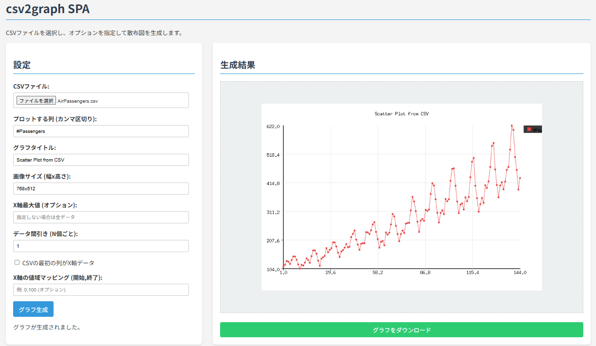

# csv2graph SPA (Go/WASM Version)

CSVファイルからインタラクティブに散布図を生成するWebアプリケーションです。Go言語とWebAssembly (WASM) を利用して実装されています。
- Rust/WASM version は [こちら](https://github.com/ryogrid/csv2graph-go-wasm/tree/rust-version)
- CLIツール（Go, Python）は [こちら](https://github.com/ryogrid/csv2graph)



## 概要

このWebアプリケーションは、ユーザーがアップロードしたCSVファイルの指定された列データを用いて散布図を描画します。グラフのタイトル、画像サイズ、データのフィルタリングや間引きなど、様々なオプションをWebインターフェース上で設定可能です。コアとなる描画処理はGo言語で実装され、WebAssemblyを介してブラウザ上で実行されます。

## 機能

*   **CSVファイルからの散布図描画:** ローカルのCSVファイルを選択してグラフを生成します。
*   **列指定:** グラフにプロットしたいデータ列をカンマ区切りで指定できます。
*   **X軸データの自動/手動:** CSVファイルの最初の列をX軸データとして使用するか、行番号をX軸として自動生成するかを選択できます (`--xdata`相当)。
*   **カスタマイズ可能なオプション:**
    *   グラフタイトルの設定 (`--title`相当)
    *   出力画像サイズの指定 (`--size`相当)
    *   X軸の最大値によるデータフィルタリング (`--range`相当)
    *   データの間引き（N個ごとにプロット） (`--skip`相当)
    *   X軸の値域を任意の値にマッピング (`--xscale`相当)
*   **インタラクティブな表示:** 生成されたグラフはWebページ上に直接表示されます。
*   **画像ダウンロード:** 生成されたグラフをPNGファイルとしてダウンロードできます。

## 技術スタック

*   **コアロジック:** Go (1.20 or later 推奨)
*   **ブラウザ実行:** WebAssembly (WASM)
*   **フロントエンド:** HTML, CSS, Vanilla JavaScript
*   **グラフ描画ライブラリ (Go):** `github.com/fogleman/gg`

## セットアップ & ビルド

このアプリケーションをローカル環境で実行するには、以下の手順に従います。

1.  **Goのインストール:** Go 1.20 以降がインストールされていることを確認してください。
2.  **リポジトリのクローン:**
    ```bash
    git clone <repository-url>
    cd csv2graph-spa
    ```
3.  **Goモジュールの準備 (任意):** `go/` ディレクトリ内で依存関係を整理します。
    ```bash
    cd go
    go mod tidy
    cd ..
    ```
4.  **WASMのビルド:** GoのコードをWebAssemblyモジュールにコンパイルします。
    ```bash
    cd go
    GOOS=js GOARCH=wasm go build -o ../static/csv2graph.wasm .
    cd ..
    ```
    これにより、`static/` ディレクトリに `csv2graph.wasm` ファイルが生成されます。
5.  **`wasm_exec.js` のコピー:** Go SDKに含まれる `wasm_exec.js` ファイルを `static/` ディレクトリにコピーします。
    ```bash
    # Goのインストールパスを確認し、そこからコピーします
    # 例: cp "$(go env GOROOT)/misc/wasm/wasm_exec.js" static/
    # もしファイルが見つからない場合は、Goの公式リポジトリからダウンロードしてください:
    # https://raw.githubusercontent.com/golang/go/master/misc/wasm/wasm_exec.js
    cp <path-to-go-sdk>/misc/wasm/wasm_exec.js static/
    ```

## 使い方

1.  **ローカルWebサーバーの起動:** `static` ディレクトリをドキュメントルートとして、ローカルWebサーバーを起動します。WASMは通常 `file://` プロトコルでは動作しないため、HTTPサーバーが必要です。
    ```bash
    # 例: Python 3 を使用する場合
    python3 -m http.server --directory static 8080

    # 例: Node.js の http-server を使用する場合 (npm install -g http-server)
    # http-server static -p 8080
    ```
2.  **ブラウザでアクセス:** Webブラウザを開き、`http://localhost:8080` (またはサーバーが使用するポート番号) にアクセスします。
3.  **CSVファイルの選択:** 「CSVファイル」セクションのファイル選択ボタンをクリックし、グラフ化したいCSVファイルを選びます。
4.  **オプションの設定:**
    *   **プロットする列:** グラフに表示したい列名をカンマ区切りで入力します (例: `temp,humidity`)。
    *   **グラフタイトル:** 表示したいグラフのタイトルを入力します。
    *   **画像サイズ:** 生成する画像のサイズを `幅x高さ` の形式で指定します (例: `800x600`)。
    *   **X軸最大値:** この値以下のX軸データのみをプロットする場合に指定します。
    *   **データ間引き:** データを間引いてプロットする場合、`N` を指定します (例: `2` なら1つおき)。
    *   **CSVの最初の列がX軸データ:** チェックを入れると、CSVの1列目をX軸の値として扱います。チェックしない場合は、行番号が自動的にX軸の値になります。
    *   **X軸の値域マッピング:** X軸の表示範囲を `開始値,終了値` の形式で指定します (例: `0,100`)。
5.  **グラフ生成:** 「グラフ生成」ボタンをクリックします。ボタンはWASMモジュールの準備が完了し、かつCSVファイルが選択されると有効になります。
6.  **結果の確認とダウンロード:**
    *   生成されたグラフが右側の「生成結果」エリアに表示されます。
    *   「グラフをダウンロード」リンクをクリックすると、表示されているグラフをPNGファイルとして保存できます。
    *   エラーが発生した場合は、設定エリア下部にメッセージが表示されます。

## CSVファイル形式の例

このツールはヘッダー行を持つCSVファイルを想定しています。

### X軸データを含む場合 (`CSVの最初の列がX軸データ` をチェック)

```csv
Time,Temperature,Humidity,Pressure
1,22.5,60.1,1013.2
2,22.7,59.8,1013.1
3,22.6,59.9,1013.3
...
```
この場合、`Time` 列がX軸、`Temperature`, `Humidity` などがY軸のデータ系列となります。

### X軸データを含まない場合 (`CSVの最初の列がX軸データ` をチェックしない)

```csv
Temperature,Humidity,Pressure
22.5,60.1,1013.2
22.7,59.8,1013.1
22.6,59.9,1013.3
...
```
この場合、X軸の値は自動的に 1, 2, 3, ... と割り当てられ、`Temperature`, `Humidity` などがY軸のデータ系列となります。

## ライセンス

[Unlicense](http://unlicense.org/)
